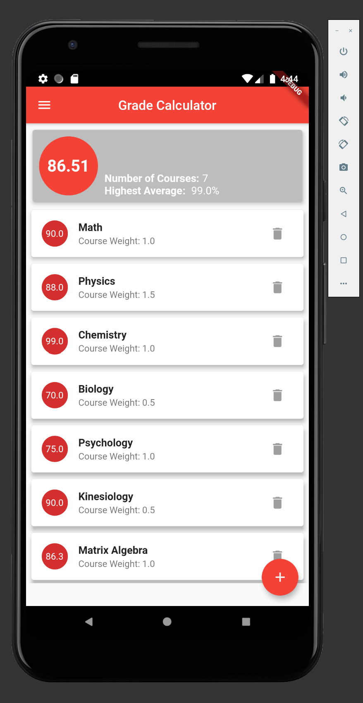
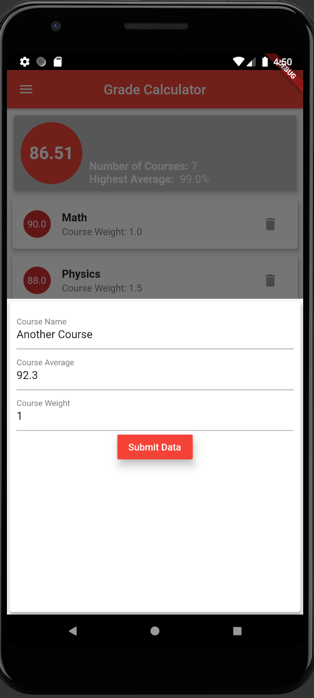
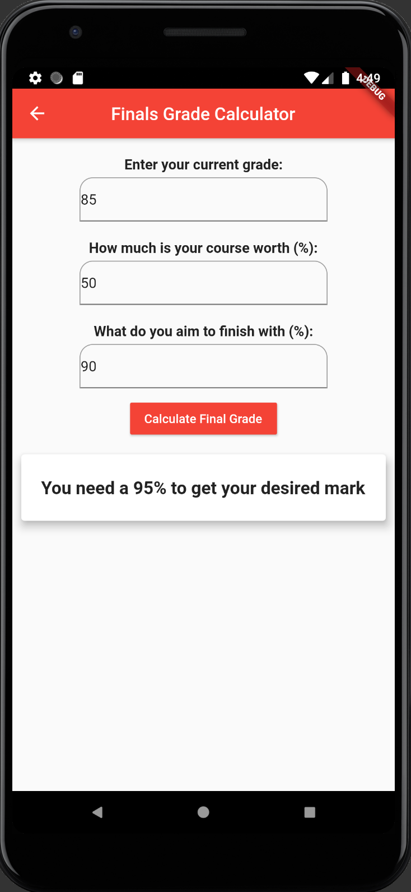
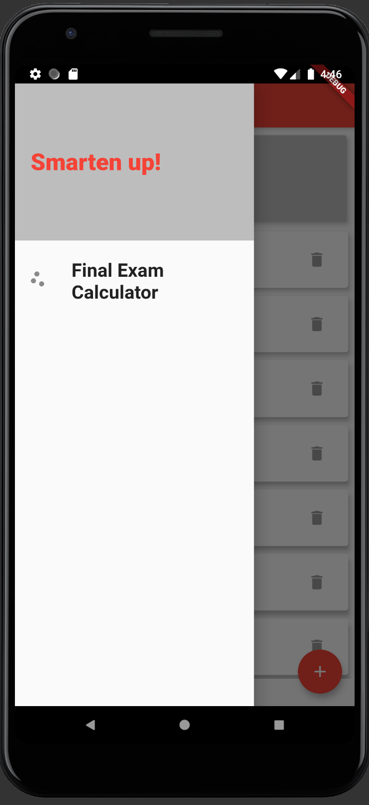

# The Grade Calculator App

I attempted to make use of a few features such as:
  1) Drawer Widget
  2) Navigator.of(context) methods
  3) Adding and removing objects/widgets from lists
  4) Proper file organization and splitting up widgets for readability and reproduction
  5) TextFields and taking inputs from users
  
  
# The Home Page

# The PopUp Modal for Registering a New Course

# The Final Exam Calculator

# The Drawer Tab

